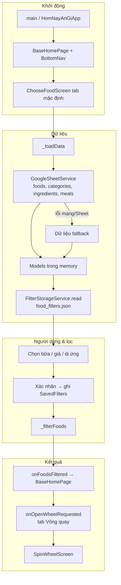

# Luồng chính — Hôm Nay Ăn Gì

Nguồn: `README.md` (tổng quan hệ thống). Cập nhật khi luồng app thay đổi.

```mermaid
flowchart TB
  subgraph boot["Khởi động"]
    M[main / HomNayAnGiApp] --> BH[BaseHomePage + BottomNav]
    BH --> CF[ChooseFoodScreen tab mặc định]
  end

  subgraph data["Dữ liệu"]
    CF --> LD[_loadData]
    LD --> GSS[GoogleSheetService\nfoods, categories, ingredients, meals]
    GSS -->|lỗi mạng/Sheet| FB[Dữ liệu fallback]
    GSS --> OK[Models trong memory]
    FB --> OK
    OK --> FS[FilterStorageService.read\nfood_filters.json]
  end

  subgraph user["Người dùng & lọc"]
    FS --> UI[Chọn bữa / giá / dị ứng]
    UI --> BTN[Xác nhận → ghi SavedFilters]
    BTN --> FF[_filterFoods]
  end

  subgraph out["Kết quả"]
    FF --> CB[onFoodsFiltered → BaseHomePage]
    CB --> WH[onOpenWheelRequested\ntab Vòng quay]
    WH --> SW[SpinWheelScreen]
  end
```
